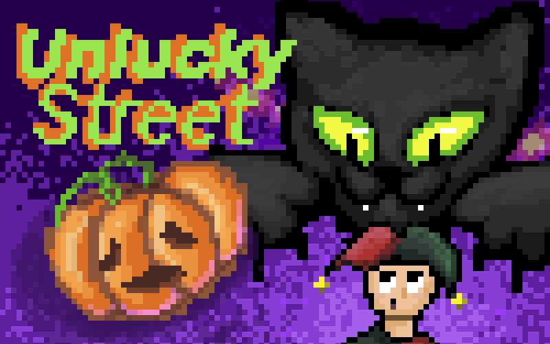

# Unlucky Street

Unlucky Street is a video game for the js13Kgames 2025 event with the theme "Black cat".

## What do you do in the game?

You play as a black cat crossing a busy Halloween street.

Your goal is to cross people's roads, causing them bad luck and gaining points for it.

However, you have to be careful, because your cat has a "happiness-meter" with 9 "happy points" on it. Each time you bump into a human, you lose one "happy point" and at zero, your cat gets annoyed and quits.

But, when you cross a road close enough to a human, they have a chance to drop a fish cracker and you can recover lost "happy points" by eating it.

The game generates the level infinitely as you're playing, so try winning as much points as you can!

## Technical

The game is built in TypeScript and entirely from scratch.

It uses `vite` to build and minify assets, including image compression.

